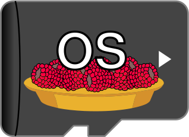

   <strong>+</strong> 
    = <strong>MonsterPi !</strong>

# MonsterPi

This repository is a Raspberry Pi image builder for running FDM Monster.
The work is a culmination of [CustomPiOS](https://github.com/guysoft/CustomPiOS) by G. Sheffer, [FarmPi](https://github.com/mkevenaar/FarmPi) by M. Kevenaar and my own private 4xOctoPrint Pi OS image.

- Please check out [FDM Monster's repository](https://github.com/fdm-monster/fdm-monster): 
- Please check out [MonsterPi's documentation](https://docs.fdm-monster.net/guides/monsterpi) to get started
- Please consider donation to the project or its individual contributors if you like this project!

<!--ts-->
<!--te-->

## How to use it?

> :warning: This image is not running [Raspberry Pi OS](https://www.raspberrypi.org/software/), therefore `raspi-config` is not available

* Unzip the image and install it to an sd card [like any other Raspberry Pi image](https://www.raspberrypi.org/documentation/installation/installing-images/README.md)
* Configure your WiFi by editing `monsterpi-wpa-supplicant.txt` on the root of the flashed card when using it like a thumb drive, or use an UTP cable
* Boot the Pi from the card
* Log into your Pi via SSH (it is located at `monsterpi.local` [if your computer supports bonjour](https://learn.adafruit.com/bonjour-zeroconf-networking-for-windows-and-linux/overview) or find the IP address assigned by your router), default username is "pi", default password is "raspberry".
  * To Change the password; run: `passwd`
  * Optionally: Change the configured timezone; run: `sudo dpkg-reconfigure tzdata`
  * Optionally: Change the hostname; run: `echo myhostname | sudo tee /etc/hostname`

    Your MonsterPi instance will then no longer be reachable under `monsterpi.local` but rather the hostname you chose postfixed with `.local`, so keep that in mind.

FDM Monster is located at [http://monsterpi.local](http://monsterpi.local) and also at [https://monsterpi.local](https://monsterpi.local). Since the SSL certificate is self signed (and generated upon first boot), you will get a certificate warning at the latter location, please ignore it.

## Features

* [FDM Monster](https://fdm-monster.net) software for managing and monitoring 100+ Octoprint instances
* [Ubuntu](https://ubuntu.com/download/raspberry-pi) Raspberry Pi distro image.

## Contributors ✨

These are the people involved in the project:
<!-- ALL-CONTRIBUTORS-LIST:START - Do not remove or modify this section -->
<!-- prettier-ignore-start -->
<!-- markdownlint-disable -->
<table>
  <tbody>
    <tr>
      <td align="center" valign="top" width="14.28%"><a href="https://github.com/davidzwa"> <b>David Zwart</b></a> <a href="https://github.com/fdm-monster/MonsterPi/issues?q=author%3Adavidzwa" title="Bug reports">🐛</a> <a href="https://github.com/fdm-monster/MonsterPi/commits?author=davidzwa" title="Code">💻</a> <a href="#maintenance-davidzwa" title="Maintenance">🚧</a> <a href="#userTesting-davidzwa" title="User Testing">📓</a></td>
      <td align="center" valign="top" width="14.28%"><a href="https://kevenaar.name"> <b>Maurice Kevenaar</b></a> <a href="https://github.com/fdm-monster/MonsterPi/commits?author=mkevenaar" title="Code">💻</a> <a href="#ideas-mkevenaar" title="Ideas, Planning, & Feedback">🤔</a> <a href="https://github.com/fdm-monster/MonsterPi/pulls?q=is%3Apr+reviewed-by%3Amkevenaar" title="Reviewed Pull Requests">👀</a></td>
    </tr>
  </tbody>
</table>

<!-- markdownlint-restore -->
<!-- prettier-ignore-end -->

<!-- ALL-CONTRIBUTORS-LIST:END -->

<!-- ALL-CONTRIBUTORS-LIST:START - Do not remove or modify this section -->
<!-- prettier-ignore-start -->
<!-- markdownlint-disable -->
<!-- markdownlint-restore -->
<!-- prettier-ignore-end -->

<table></table>

<!-- ALL-CONTRIBUTORS-LIST:END -->
